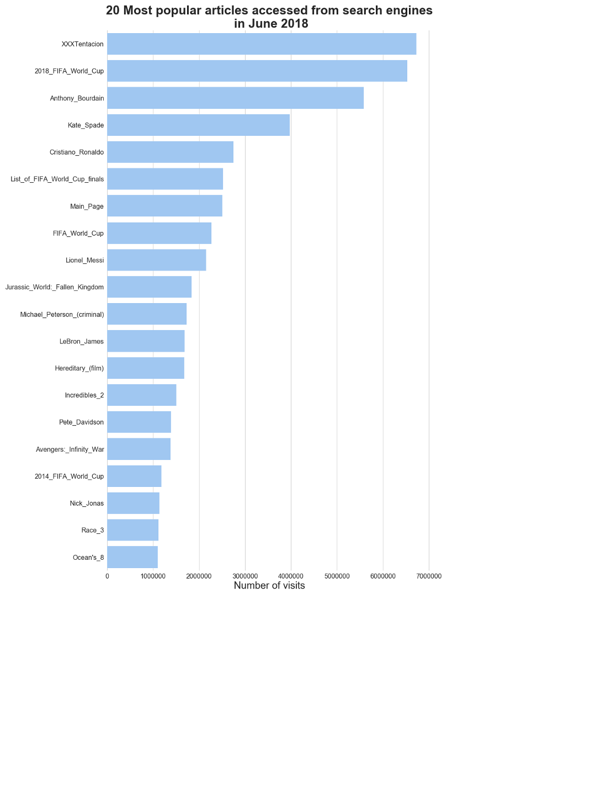

# Wikipedia clickstream initial analysis

## Tasks

Prepare a Jupyter Notebook that shows how to:

1. Determine which links people click on most frequently in a given article.
2. Determine the most common referrers for a given article.
3. Determine what percentage of all visitors clicked on a link within a given article.
4. Determine and visualize the most popular articles people accessed from all external search engines.

Single month data dump was used in the analysis:

https://dumps.wikimedia.org/other/clickstream/2018-06/clickstream-enwiki-2018-06.tsv.gz

Analysis was performed using standard data science python stack (see `requirements.txt`).

## Results:

1. Determine which links people click on most frequently in a given article.

    **Answer**: 2018_FIFA_World_Cup

2. Determine the most common referrers for a given article.

    **Answer**: search engines

3. Determine what percentage of all visitors clicked on a link within a given article.

    **Answer**: 22.88% 

4. Determine and visualize the most popular articles people accessed from all external search 

    **Answer**:

